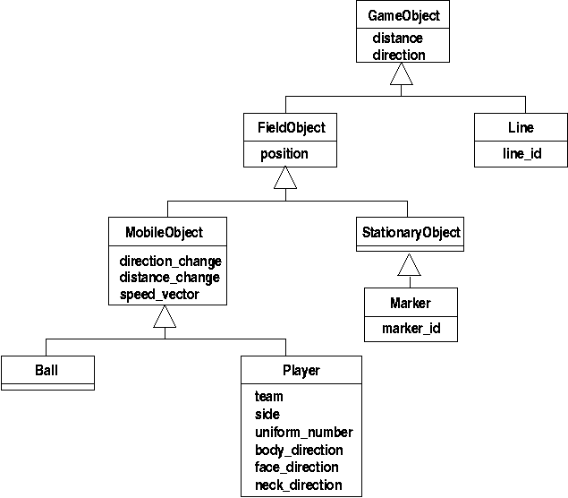

Last update: |today|

# Soccer Server

## Objects

{: align=center scale="80%" name="objects"}

## Protocols



## Sensor Models



## Movement Models



## Action Models













### Foul Model

**TODO**

- [14.0.0] foul model and intentional foul option
- [14.0.0] trade off between foul detect probability and kick power rate
- [15.0.0] improve foul model (red_card_probability)











## Heterogeneous Players



## Referee Model



## The Soccer Simulation



## Using Soccerserver


